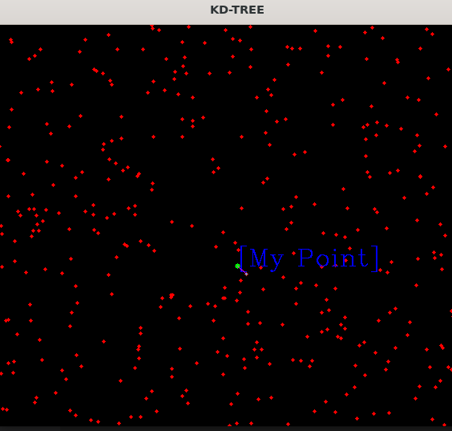
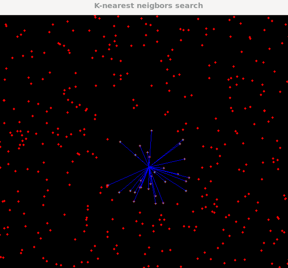
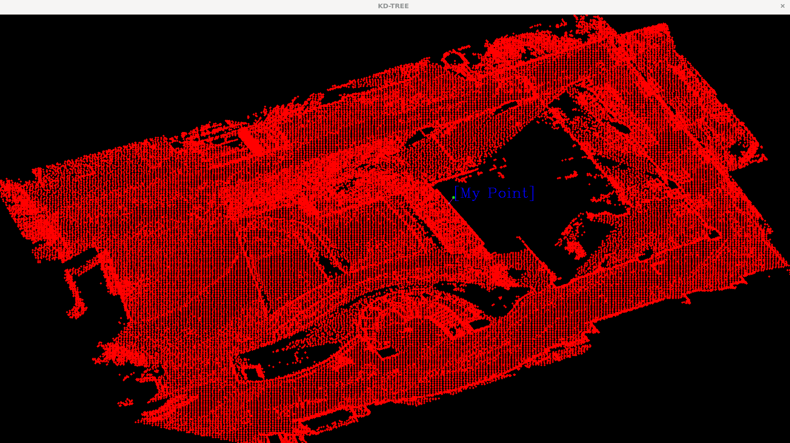
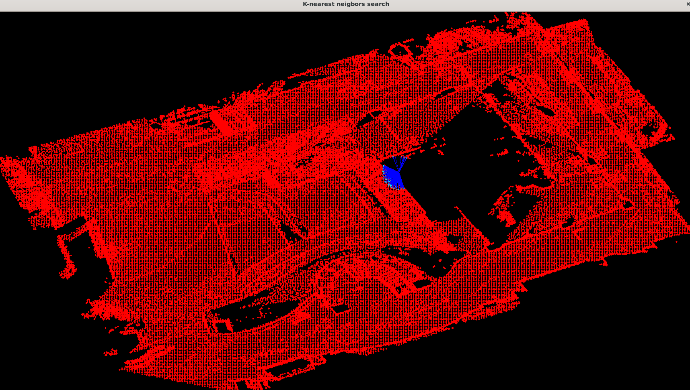
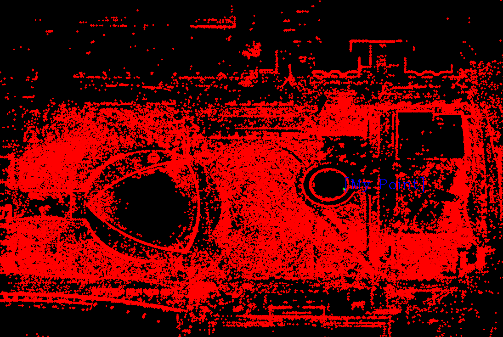
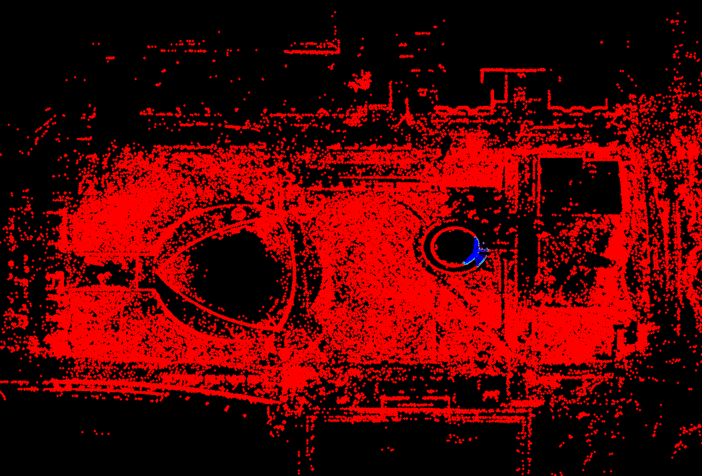

# KD Tree & KNN [2D]
## Overview
####  As you know, KDTREE is an algorithm that efficiently sorts large amounts of data, and KNN (KNN) is the ability to search for a specific range of data using KD Tree.

#### This is an example code, which uses a recursive function to sort the data. We also leverage the Eucladian distance to run KNN.

#### Please look at it with the comments in the main and make it useful. Thank you.
---
--- 

## build

```bash
$> cd KD-Tree_and_KNN
$> mkdir build && cd build
$> cmake .. && make
$> ./kdtree
```
---
## Select Senario
### Choose Senario. 0=Sample, 1=Pcd

_
## Senario 0
▶ 1. You must choose Width and Height for Point Area [Width, Height]

▶ 2. Write the number of Points to create

▶ 3. Write the Root position [x, y] for find nearest point

▶ 4. Write K Point whatever you want. This is the number of Near position data of Root position

<p align="center">
    
    
</p>


_
## Senario 1 
▶ 1. Write the Root position [x, y] for find nearest point

▶ 2. Write K Point whatever you want. This is the number of Near position data of Root position

### Sample.pcd
<p align="center">
    
    
</p>

### CornerMap.pcd
<p align="center">
    
    
</p>